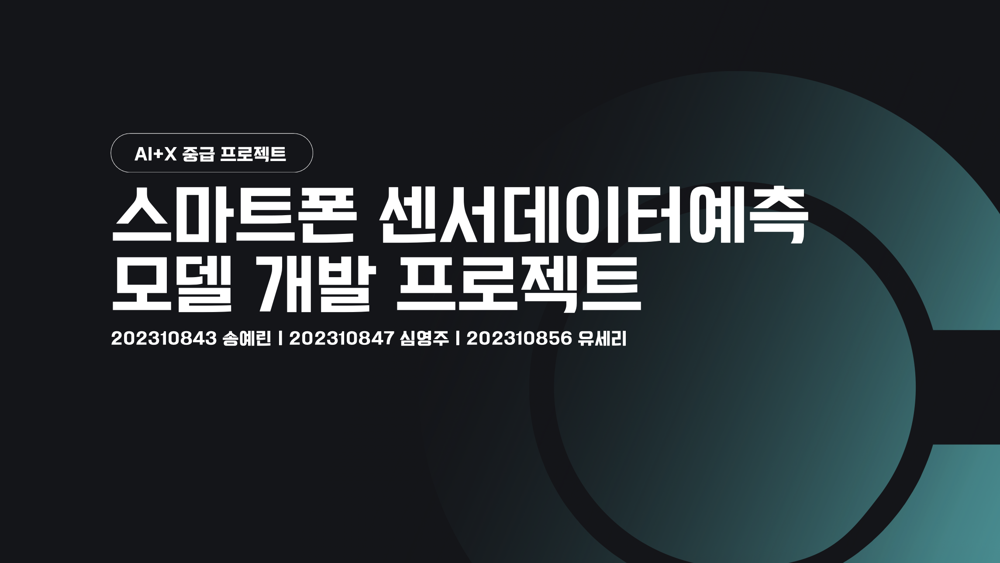
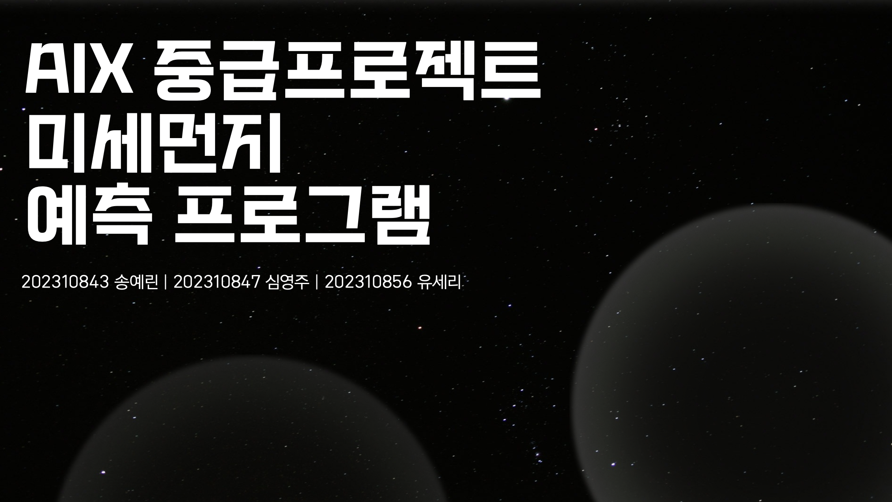

# 💻 2024-2 AI+X 선도인재양성 중급프로젝트 (with KT)

2024-2 학기 **AI+X 선도인재양성 중급프로젝트 with KT** 과정에서 수행한 ML 과제/프로젝트를 정리한 레포지토리입니다.  
초급에서 EDA로 데이터의 특징을 이해했다면, 중급에서는 **머신러닝 모델링 및 단계별 파이프라인 설계**를 통해 예측 성능을 개선하는 흐름으로 확장했습니다.

## What’s inside

- **01 | 스마트폰 센서 데이터 예측 모델 개발 (Team Project)**  
  스마트폰 센서 데이터 기반 인간 행동(HAR) 분류 모델을 개발하고,  
  **기본 모델링 vs 단계별(2-stage) 모델링**을 비교했
- **02 | 미세먼지 농도 예측 모델 개발 (Team Project)**  
  서울 지역 미세먼지/기상 데이터를 기반으로 예측 모델을 개발하고,  
  다양한 회귀 모델 및 시계열 모델(ARIMA)까지 확장해 성능을 비교

---

# 01. 스마트폰 센서 데이터 예측 모델 개발 (Team Project)

### Goal
스마트폰 센서 데이터 기반 인간 행동(HAR)을 분류하는 최적의 ML 모델을 구현하고,  
단일 모델 접근을 넘어 **단계별(2-stage) 구조**를 적용해 성능/안정성 개선을 시도했습니다.

### Key Points
- **Basic Modeling**: Logistic Regression / RandomForest / XGBoost / CatBoost 성능 비교
- **2-stage Modeling**: 정적(0)·동적(1) 행동 1차 분류 후, 세부 동작을 추가 분류하는 단계별 모델링
- (추가) 생성형 AI 답변 비교 실험 포함

### Deliverables
- 📄 Final Presentation (PDF): `01_smartphone_sensor_ml/slides/smartphone_sensor_final_slides.pdf`

---

# 02. 미세먼지 농도 예측 모델 개발 (Team Project)

### Goal
서울 지역 미세먼지 농도 예측을 목표로, 전처리/변수 선별 후 예측 모델을 개발하고  
모델 계열별 성능을 비교하며 최적의 접근을 탐색했습니다.

### Approach
- 회귀 모델 비교: RandomForest / XGBoost / LightGBM / CatBoost
- 시계열 모델 실험: ARIMA

### Deliverables
- 📄 Final Presentation (PDF): `02_fine_dust_ml/slides/fine_dust_final_slides.pdf`

---

## Team
- Members: 송예린 · 심영주 · 유세리
